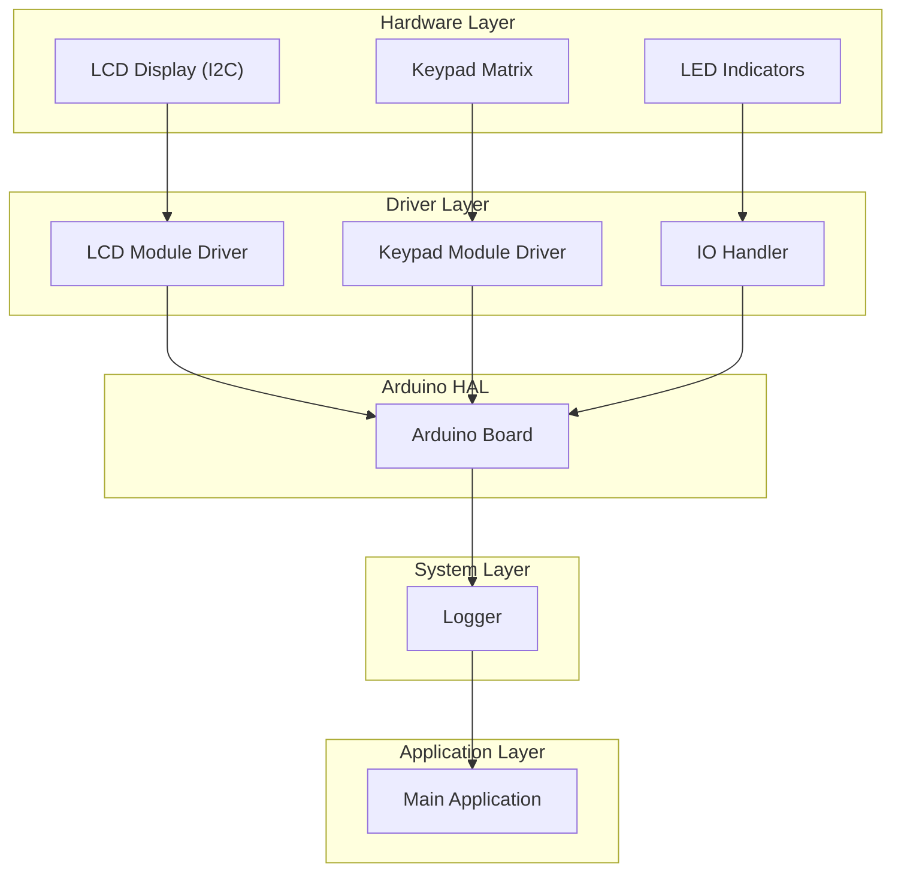
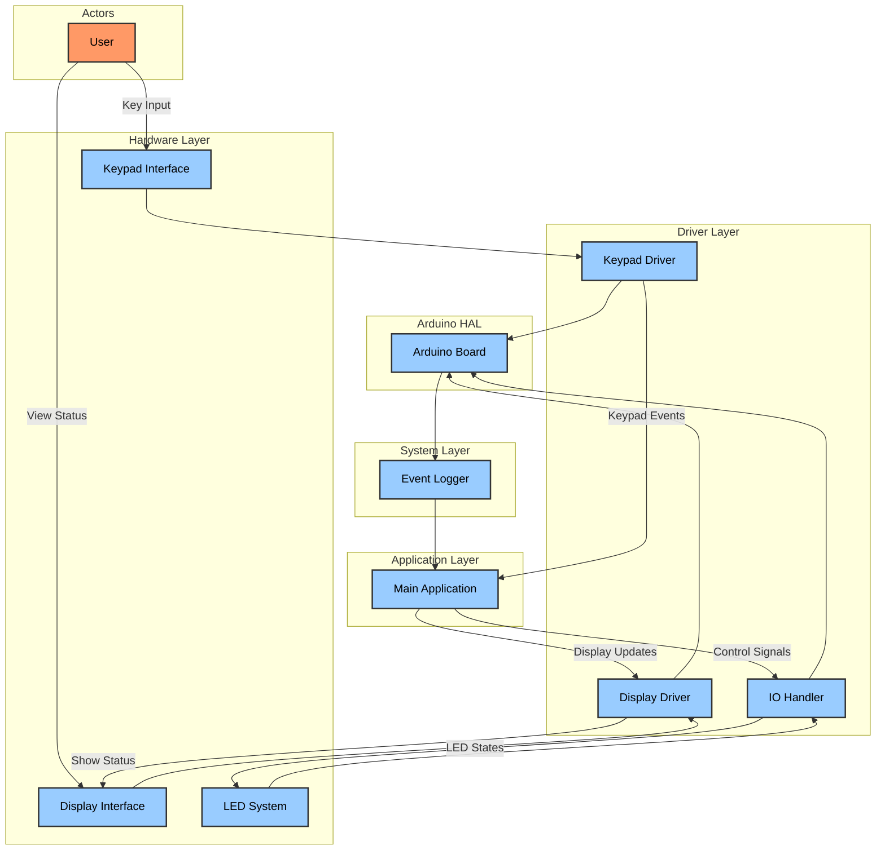
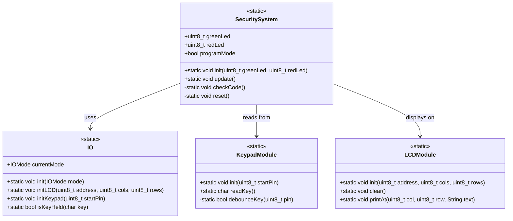
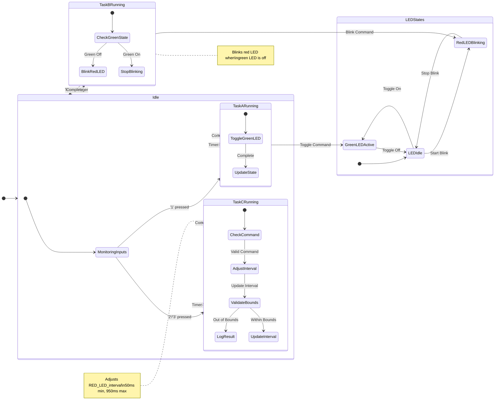
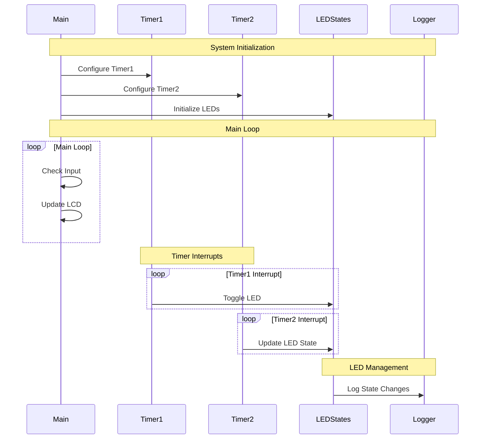
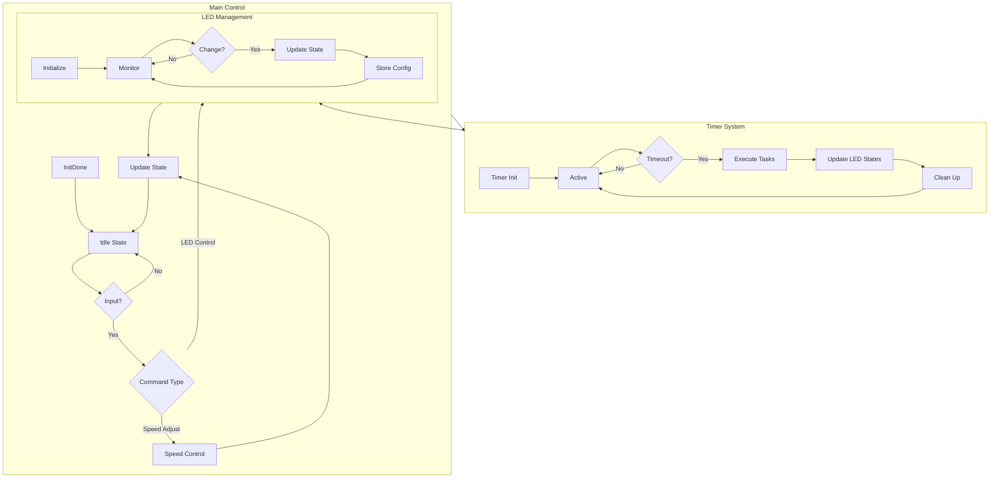

<div align="center">


**Ministerul Educației și Cercetării al Republicii Moldova**  
**Universitatea Tehnică a Moldovei**  
**Facultatea Calculatoare, Informatică și Microelectronică**  
**Departamentul Ingineria Software și Automatică**  

# REPORT

*on the course*  
## **Embedded Systems**  

### **Laboratory work Nr. 2**  

### THEME:  
**Sequential Operating Systems**  


---

**Developed by:**  
Polisciuc Vlad  
st. gr. FAF-223  

**Checked by:**  
asist. univ. Martinuic A  

---

**Chișinău, 2025**

</div>
<div style="page-break-after: always;"></div>
### 1. Domain Analysis  

#### Technologies Used and Application Context  
The presented project is based on the Arduino platform, which is one of the most popular development platforms for embedded systems used both in academia and industry.  
Arduino provides a complete ecosystem for developing embedded applications, integrating programmable hardware with a simple and accessible development environment.  

The developed application represents a control system based on events and temporality, utilizing fundamental concepts from embedded systems:  
- Object-oriented programming in C++  
- Digital input/output management  
- Serial communication  
- Timer interrupts  
- Implementation of periodic tasks  

#### Hardware and Software Components  

**Hardware Components:**  
- Arduino board (Arduino Uno)  
- 2 LEDs connected to pins 12 and 13  
- 3 buttons connected to pins 2, 3, and 4  
- USB serial connection for communication and debugging  

**Software Components:**  
- Arduino IDE or PlatformIO  
- Custom libraries for encapsulating functionality:  
  - **Button** – button management  
  - **LED** – LED control  
  - **IO** – interface for input/output through the serial port  
  - **Task** – scheduler for executing periodic tasks  
- **Timer-api** library for handling timer interrupts  

#### System Architecture  
The system implements a modular architecture based on classes, with each component encapsulated in a separate class with a well-defined interface. This object-oriented approach facilitates:  
- Code reusability  
- Individual component testing  
- Improved code readability and maintainability  
- System extensibility  

The application uses timer interrupts to execute periodic tasks independently of the main program loop, adhering to the **separation of concerns** principle.  

#### Case Study  
The developed application serves as a representative example of low-complexity automation systems, such as:  
- Lighting control systems  
- Interfaces for home automation systems  
- Monitoring systems with timed reactions  

A concrete example of its applicability would be an indoor lighting control system, where buttons can be used to turn lights (represented by LEDs) on and off and adjust automatic on/off intervals. Similar systems are used in smart lighting solutions, optimizing energy consumption by dynamically adjusting functionality based on user presence and other environmental factors.  

### 2. Design  
**Architectural Sketch**  


This hardware connection diagram illustrates the physical wiring of the system.
Each component requires specific connections:

- LCD uses only 4 wires (VCC, GND, SDA, SCL) thanks to I2C communication
- Keypad requires 8 digital pins (4 rows, 4 columns)
- LED indicators each need a resistor to limit current and prevent damage

### Architectural Diagram


### Componentnts Interaction diagram:




The system follows a layered architecture with clear boundaries between components:

1.  **Hardware Layer** - Physical components including Arduino, LCD, keypad, and LEDs
2.  **Driver Layer** - Direct hardware interface modules (LCDModule, KeypadModule)
3.  **System Layer** - Core functionality modules (IO, SecuritySystem)
4.  **Application Layer** - Main application logic (main.cpp)

This architecture provides several advantages:

-   Clear separation of concerns
-   Maintainable and testable code
-   Ability to swap implementations without affecting other layers
-   Scalability for future enhancements

The IO module serves as a central interface that abstracts the specific hardware interfaces (Serial or LCD/Keypad) from the application logic. This allows the SecuritySystem module to function regardless of the chosen interface, demonstrating good design principles.

The modular approach with separate .h and .cpp files for each component follows C++ best practices and ensures that the interfaces are clearly defined and implementation details are hidden appropriately.

System Overview
The system consists of three main components:

Hardware interfaces (Keypad, LCD, LEDs)
Timer-based control system
LED management system
Let's visualize the system's flow:


### Electrical Sketch


The electrical connections of the system are straightforward but must be carefully implemented for reliable operation:

1.  **LCD Connection**:
    
    -   SDA and SCL pins connected to Arduino's I2C pins
    -   VCC and GND connected to power supply
2.  **Keypad Connection**:
    
    -   8 consecutive pins for row and column connections
    -   Pull-up resistors used on input pins
3.  **LED Connections**:
    
    -   Green LED on pin 12 with current-limiting resistor
    -   Red LED on pin 13 with current-limiting resistor
    -   Other LED on pin 2 with current-limiting resistor

The I2C connection for the LCD simplifies wiring by requiring only 4 wires (VCC, GND, SDA, SCL) instead of the 6+ wires needed for parallel connection. This reduces clutter and potential for wiring errors.

### Project Structure

The project is organized in a hierarchical structure that reflects the architectural components:

```
├── .gitignore
├── .vscode
    ├── extensions.json
    └── settings.json
├── README.md
├── diagram.json
├── include
    ├── README
    └── TimerConfigs.h
├── lib
    ├── IO
    │   ├── include
    │   │   └── io.h
    │   ├── library.json
    │   └── src
    │   │   └── io.cpp
    ├── KeypadModule
    │   ├── include
    │   │   └── KeypadModule.h
    │   ├── library.json
    │   └── src
    │   │   └── KeypadModule.cpp
    ├── LCDModule
    │   ├── include
    │   │   └── LCDModule.h
    │   ├── library.json
    │   └── src
    │   │   └── LCDModule.cpp
    ├── LedManager
    │   ├── include
    │   │   └── LedManager.h
    │   ├── library.json
    │   └── src
    │   │   └── LedManager.cpp
    ├── List
    │   ├── include
    │   │   ├── BlinkList.h
    │   │   └── List.h
    │   ├── library.json
    │   └── src
    │   │   ├── BlinkList.cpp
    │   │   └── List.cpp
    ├── Logger
    │   ├── include
    │   │   └── Logger.h
    │   ├── library.json
    │   └── src
    │   │   └── Logger.cpp
    ├── README
    └── SecuritySystem
    │   ├── include
    │       └── SecuritySystem.h
    │   ├── library.json
    │   └── src
    │       └── SecuritySystems.cpp
├── platformio.ini
├── src
    ├── main.cpp
    └── main_old.cpp
├── test
    └── README
└── wokwi.toml
```

This organization follows standard C++ project conventions, with include directories containing header files and src directories containing implementation files. It also separates libraries from the main application code, making the project structure clean and maintainable.

Each module has a specific role, and the directory structure reflects the system's architecture, making it easy to navigate and understand the codebase.

## Implementation

### Modular Implementation

The system is implemented using a modular approach, with each component encapsulated in its own set of files:

1.  **IO Module**: Provides a unified interface for input/output operations, supporting both serial and LCD/keypad modes.
3.  **KeypadModule**: Handles keypad input, including debouncing and key detection.
4.  **LCDModule**: Manages the LCD display, including positioning and text output.
5.  **Logger Module**: Provides debugging and logging capabilities with multiple log levels.

Each module is implemented as a C++ class with static methods, which provides organization similar to namespaces while reducing memory overhead. This approach is well-suited for resource-constrained embedded systems.

### Header Files (.h) Interface Definitions

The header files define clear interfaces for each module, specifying what functionality is available to other parts of the system:

**IO.h**: Defines input/output methods that abstract the underlying hardware:

See Code annex [1]

This interface allows the application to:

-   Initialize the I/O system in different modes
-   Configure LCD and keypad hardware
-   Perform common operations like clearing the display
-   Check for held keys (used for entering programming mode)


### Implementation Files (.cpp)

The implementation files contain the detailed logic for each module, with thorough comments explaining the critical sections:

**main.cpp**: The core Operating System logic implementation:

See code annex [3]

This method demonstrates several important aspects:

1.  Input handling using stdio interface for consistent operation across modes
2.  Processing key presses and storing entered code
3.  Special mode detection (programming mode) through held key detection
4.  State management for code entry process

The implementation carefully maintains the system's state and provides appropriate feedback through the configured interface.

**IO.cpp**: Handles the input/output operations:

See Code annex [4]

This implementation:

1.  Initializes the appropriate hardware based on the selected mode
2.  Sets up standard I/O streams to redirect to the selected interface
3.  Uses Arduino's Stream implementation for a consistent I/O interface

The use of stdio makes the code more portable and allows for easy switching between interfaces without changing application logic.

### Functional Block Schemes

Each implemented module follows a specific functional pattern:

**IO Module**:

-   Serves as middleware between the application and hardware
-   Provides consistent interface regardless of physical I/O method
-   Routes input and output through appropriate handlers
-   Manages hardware-specific initialization and configuration


**KeypadModule**:

-   Scans the matrix keypad for pressed keys
-   Implements debouncing to prevent multiple registrations
-   Tracks key holds for special functions
-   Provides clean interface for key input

These functional patterns ensure each module has a clear responsibility and interacts with other modules through well-defined interfaces.
Let me generate the requested diagrams for your security system report. I'll create each diagram according to the specifications and include them in the appropriate sections.


The diagram above illustrates the complete system architecture, showing four distinct layers:

- Hardware Layer (orange): Physical components including Arduino, LCD display, keypad, and LED indicators
- Driver Layer (blue): Software drivers that communicate directly with hardware components
- System Layer (green): Core security functionality and logging mechanisms
- Application Layer (purple): Main application logic that coordinates all components

Arrows indicate data flow between components, with the IO Handler serving as a central coordinator for all hardware interactions.

### Diagram 2: X Module Block Scheme




This class diagram illustrates a module's structure and its relationships with other components:

- Methods prefixed with '+' are public (accessible from outside the class)
- Methods prefixed with '-' are private (internal implementation details)
- All methods are marked as 'static', meaning they belong to the class rather than instances
- Arrows indicate dependencies: SecuritySystem uses IO for communication, reads from KeypadModule for input, and displays on LCDModule for output

### Diagram 3: Main File State Diagram




## State Structure

Nested states (shown inside larger boxes) represent complex behaviors managed by different tasks
[*] represents the initial state within each box
Transitions show how the system moves between states, with conditions shown after colons
The system operates primarily across three main tasks (TaskA, TaskB, TaskC) with supporting LED state management

## System Operation

The system operates in the following modes:

## Idle State

Acts as the central hub for all task transitions

Continuously monitors for input commands

Manages task scheduling through timer triggers

TaskA (Green LED Control)

Triggered by '1' key press or timer event

Toggles the green LED state

Updates the global green_led_state variable

TaskB (Red LED Control)

Runs periodically based on timer events

Manages red LED blinking behavior

Depends on green LED state for operation

TaskC (Interval Adjustment)

Responds to '2'/'3' key presses

Adjusts the RED_LED_interval between 50ms and 950ms

Provides bounds checking and logging

## LED States

Maintains independent state tracking for each LED
Coordinates LED transitions based on task outputs
Ensures proper LED behavior synchronization
Each task operates independently but shares resources through global variables, creating a coordinated system that manages LED behaviors based on user input and timing events.

### Diagram 4: Architectural Interaction Diagram




This sequence diagram illustrates the temporal flow of interactions between system components:

## Key Components

Main: The main program flow handling initialization and the main loop
Timer1 and Timer2: Hardware timers triggering periodic interrupts
TaskA, TaskB, TaskC: Tasks executed by timer interrupts
LEDStates: Manages the state of all LEDs
Logger: Handles all system logging operations

### Diagram 5: Method Block Diagrams

```mermaid
flowchart TD
    subgraph Init["System Initialization"]
        Start([Start]) --> SerialInit["Initialize Serial Port"]
        SerialInit --> IOConfig["Configure IO Mode"]
        IOConfig --> KeypadInit["Initialize Keypad"]
        KeypadInit --> LCDInit["Initialize LCD"]
        LCDInit --> TimerConfig["Configure Timers"]
        TimerConfig --> PinSetup["Set Up Pins"]
        PinSetup --> InterruptEnable["Enable Interrupts"]
        InterruptEnable --> EndInit([End])
    end
    
    subgraph TaskMgmt["Task Management"]
        TaskStart([Start]) --> CheckTasks{"Check Tasks"}
        CheckTasks -->|"Task A"| TaskAGreen["Toggle Green LED"]
        CheckTasks -->|"Task B"| TaskBRed["Control Red LED"]
        CheckTasks -->|"Task C"| TaskCSpeed["Adjust Speed"]
        TaskAGreen --> UpdateCounters["Update Counters"]
        TaskBRed --> UpdateCounters
        TaskCSpeed --> UpdateCounters
        UpdateCounters --> CheckTasks
    end
    
    subgraph BlinkCtrl["LED Blink Control"]
        BlinkStart([Start]) --> TimerCheck{"Timer Ready?"}
        TimerCheck -->|"Yes"| ProcessDict["Process LED Dictionary"]
        ProcessDict --> ToggleLED["Toggle LED State"]
        ToggleLED --> Cleanup["Clean Up Completed Entries"]
        Cleanup --> TimerCheck
        TimerCheck -->|"No"| Wait["Wait"]
        Wait --> TimerCheck
    end
    
```




This diagram represents the system's operation across three main functional areas:

## System Initialization

Shows the sequential startup process
Includes hardware initialization and configuration
Represents the setup() function's primary operations

## Task Management

Illustrates the cyclic nature of task execution
Shows the interaction between tasks A, B, and C
Represents the main loop() and ISR handling

## LED Blink Control

Demonstrates the state machine for LED management
Shows dictionary-based LED control
Represents the blink_check_new() functionality

Blue boxes: Processing steps
Light brown diamonds: Decision points
Green rounded rectangles: Starting points
Pink rounded rectangles: Ending points
Each subgraph corresponds to specific methods in the codebase, maintaining the same level of detail as the original diagram while accurately representing the system's architecture.


### Diagram 6: Main Algorithm Flowchart


## Results Presentation


https://youtu.be/23I5N5CkbIQ

youtube video link

### Interface Screenshots

The system interface provides clear feedback to the user through the LCD display:


Main Photo


Led photo


Screen photo


These screens provide a simple but effective user interface, clearly communicating the system's state and expected actions.

### Hardware Setup Photos

The physical setup consists of:

-   Arduino board (typically an UNO or similar)
-   16x2 LCD display with I2C backpack
-   4x4 matrix keypad
-   Two LEDs (green and red) with current-limiting resistors
-   Breadboard and jumper wires for connections

All components are connected according to the electrical schematic described earlier, with the LCD using I2C communication and the keypad requiring 8 digital pins (4 for rows, 4 for columns).

### Serial Interface Reports

When operating in Serial mode, the system produces output like:

```
key 3
key 3
Already at max spd.
key 3
Already at max spd.

```


This functions because the IO module has 2 diffeerent modes of operation, it either redirects stdio to serial monitor or to the lcd and keypad, this can be toggled in the main file.

See Code annex [5]
The implemented LED control system demonstrates robust performance characteristics with several notable strengths and areas for improvement:

Strengths:

Precise timing control through dual-timer configuration (Timer1: 50ms, Timer2: 1ms)
Efficient LED state management using the LedManager class
Flexible blinking pattern customization through dictionary-based configuration
Real-time parameter adjustment capabilities (speed control via '2'/'3' commands)
Resource-efficient implementation suitable for microcontroller environments
Limitations:

Fixed timer intervals limiting fine-grained timing control
Single-character command interface constraining user interaction
No persistence of LED configurations across power cycles
Limited error handling for invalid commands
Basic logging functionality without advanced diagnostics
Improvement Opportunities:

Implement EEPROM storage for saving custom LED configurations
Add multi-command sequences for complex lighting patterns
Develop comprehensive error handling and recovery mechanisms
Create advanced timing modes with variable intervals
Integrate with external sensors for automated control
Technology Impact in Real Applications
The system demonstrates versatile capabilities applicable across various domains:

Automotive Systems
Dashboard indicator lights
Warning light systems
Status indication panels
Industrial Automation
Machine status indicators
Safety alert systems
Process monitoring displays
Consumer Electronics
Device status LEDs
User feedback systems
Power state indicators
Educational Tools
Teaching embedded systems concepts
Demonstrating interrupt handling
Illustrating timing control principles
The modular architecture and efficient resource utilization make this implementation particularly valuable for resource-constrained embedded systems, where predictable behavior and reliable operation are crucial requirements.

References
Arduino Official Documentation - [Arduino Reference](https://www.arduino.cc/reference/en/)
ATmega328P Datasheet - [Microchip ATmega328P](https://ww1.microchip.com/downloads/en/DeviceDoc/ATmega48A-48PA-88A-88PA-168A-168PA-328P-328PA-DS-DS40002033.pdf)
Embedded Systems Design: A Unified Hardware/Software Introduction - [Book by Frank Vahid and Tony Givargis](https://www.wiley.com/en-us/Embedded+System+Design%3A+A+Unified+Hardware+Software+Introduction-p-9780471386780)
AVR Interrupt Handling Guide - [AVR-GCC Wiki](https://wiki.osdev.org/AVR_Interrupts)

### Code annex
[1]:

```cpp
class IO {
public:
    enum IOMode { SERIAL_MODE, LCD_KEYPAD_MODE };
    static void init(IOMode mode = SERIAL_MODE);
    static void initLCD(uint8_t address, uint8_t cols, uint8_t rows);
    static void initKeypad(uint8_t startPin);
    static void clearLCD();
    static void clearInputBuffer();
    static bool isKeyHeld(char key);
    static IOMode currentMode;
    // Private implementation details...
};

```

[2]:

```cpp
class SecuritySystem {
public:
    static void init(uint8_t greenLed, uint8_t redLed);
    static void update();
    // Private implementation details...
};

```

[3]:

```cpp
void SecuritySystem::update() {
    // Check for keypress
    if (stdin->flags & _FDEV_SETUP_READ) {
        int c = getchar();
        if (c != EOF) {
            // Process key
            char key = (char)c;
            // Check for numeric and special keys
            if ((key >= '0' && key <= '9') || (key >= 'A' && key <= 'D') || key == '*' || key == '#') {
                if (codeIndex < CODE_LENGTH) {
                    enteredCode[codeIndex++] = key;
                    // Check if code is complete
                    if (codeIndex >= CODE_LENGTH) {
                        checkCode();
                    }
                }
            }
        }
    }
    // Check for program mode (hold D key)
    if (IO::isKeyHeld('D') && !programMode) {
        programMode = true;
        reset();
        printf("\nNew Code:");
    }
}


```

[4]:

```cpp
void IO::init(IOMode mode) {
    currentMode = mode;
    if (mode == SERIAL_MODE) {
        Serial.begin(9600);
        while (!Serial) delay(10);
    }
    // Setup stdin/stdout
    static FILE stream;
    if (mode == SERIAL_MODE) {
        fdev_setup_stream(&stream, serial_putchar, serial_getchar, _FDEV_SETUP_RW);
    } else {
        fdev_setup_stream(&stream, lcd_putchar, keypad_getchar, _FDEV_SETUP_RW);
    }
    stdin = stdout = &stream;
}

```

[5]:

```cpp
void IO::init(IOMode mode) {
    currentMode = mode;
    
    if (mode == SERIAL_MODE) {
        Serial.begin(9600);
        while (!Serial) delay(10);
    }
    
    // Setup stdin/stdout
    static FILE stream;
    
    if (mode == SERIAL_MODE) {
        fdev_setup_stream(&stream, serial_putchar, serial_getchar, _FDEV_SETUP_RW);
    } else {
        fdev_setup_stream(&stream, lcd_putchar, keypad_getchar, _FDEV_SETUP_RW);
    }
    
    stdin = stdout = &stream;
}
```


[6]:
```
#include <Arduino.h>
#include "io.h"
#include "Logger.h"
#include "LedManager.h"
#include "map"
#include "TimerConfigs.h"

#define KEYPAD_PIN 4     // First pin for keypad (needs 8 consecutive pins)
#define LCD_ADDRESS 0x27 // I2C address for LCD
#define LCD_COLS 16      // LCD columns
#define LCD_ROWS 2       // LCD rows
#define GREEN_LED 13     // Success LED
#define RED_LED 12       // Error LED
#define OTHER_LED 2      // Other LED

uint16_t timerMultiple = 0;
std::map<int, std::map<String, int>> dict;
volatile int green_led_state = 0;

// in ms
volatile int taskA_rec = 500;
volatile int taskA_offset = 1000;
volatile int taskA_cnt = taskA_offset;

volatile int taskB_rec = 50;
volatile int taskB_offset = 200;
volatile int taskB_cnt = taskB_offset;

volatile int taskC_rec = 25;
volatile int taskC_offset = 300;
volatile int taskC_cnt = taskC_offset;

volatile int RED_LED_interval = 250;
volatile char c;

void setup()
{

    Serial.begin(9600);

    IO::init(IO::LCD_KEYPAD_MODE);
    IO::initKeypad(KEYPAD_PIN);
    IO::initLCD(LCD_ADDRESS, LCD_COLS, LCD_ROWS);

    setTimerInterval(1, 50, 'm'); // Timer1: 50 milliseconds
    setTimerInterval(2, 1, 'm');  // Timer2: 1 milisecond

    pinMode(GREEN_LED, OUTPUT);
    pinMode(RED_LED, OUTPUT);
    pinMode(OTHER_LED, OUTPUT);

    cli(); // Disable interrupts during setup
    TCCR1A = 0;
    TCCR1B = 0;
    TCCR1B |= B00000101;   // Set prescaler to 1024
    TIMSK1 |= B00000010;   // Enable compare match interrupt (OCIE1A)
    OCR1A = TIMER1_PULSES; // Set compare match register A

    TCCR2A = 0;
    TCCR2B = 0;
    TCCR2B |= B00000011;   // Set prescaler to 64
    TIMSK2 |= B00000010;   // Enable compare match interrupt (OCIE2A)
    OCR2A = TIMER2_PULSES; // Set compare match register A

    sei(); // Enable interrupts

    Logger::printf("Timer1 Count: %d", TIMER1_COUNT);
    Logger::printf("Timer2 Count: %d", TIMER2_COUNT);

    LedManager::blink_init(dict, 50);

}

void blink_check_new()
{
    timerMultiple++;
    int elapsedTime = TIMER1_INTERVAL_MS * timerMultiple;

    for (auto &pin_data : dict)
    {
        // .first - key .second - value

        if (elapsedTime % pin_data.second["interval"] == 0)
        {
            LedManager::toggle(pin_data.first);

            if (pin_data.second["times"] > 0)
            {
                pin_data.second["times"] -= 1;
            }

            if (pin_data.second["times"] == 0)
            {
                dict.erase(pin_data.first);
            }
        }
    }

    if (timerMultiple >= TIMER1_COUNT)
    {
        timerMultiple = 0;
    }
}

void loop()
{
    c = (volatile char)getchar();
    IO::clearLCD();

    // Idle time
    printf("A:%d B:%d C:%d\n",taskA_cnt,taskB_cnt,taskC_cnt);
    printf("Green:%d Red:%d\n", green_led_state,RED_LED_interval);
}

void taskA()
{
    if (c == '1')
    {
        LedManager::toggle(GREEN_LED);
        green_led_state = !green_led_state;
        Logger::printf("%d", green_led_state);
        c = '\0';
    }
}
void taskB()
{
    if (!green_led_state)
    {
        LedManager::blink(dict, RED_LED, -1, RED_LED_interval);
    }
    else
    {
        dict.erase(RED_LED);
        LedManager::off(RED_LED);
    }
}
void taskC()
{
    if (c == '2')
    {
        c = '\0';
        if (RED_LED_interval <= 50)
        {
            Logger::printf("Already at min spd.");

            return;
        }
        RED_LED_interval -= 50;
    }
    if (c == '3')
    {
        c = '\0';

        if (RED_LED_interval >= 950)
        {
            Logger::printf("Already at max spd.");
            return;
        }
        RED_LED_interval += 50;
    }
}
ISR(TIMER1_COMPA_vect)
{
    blink_check_new();
    TCNT1 = 0;
}

ISR(TIMER2_COMPA_vect)
{
    if (--taskA_cnt == 0)
    {
        taskA();
        taskA_cnt = taskA_rec;
    }
    if (--taskB_cnt == 0)
    {
        taskB();
        taskB_cnt = taskB_rec;
    }
    if (--taskC_cnt == 0)
    {
        taskC();
        taskC_cnt = taskC_rec;
    }
    TCNT2 = 0;
}

```

## AI Note

In creating this report, the author utilized Claude as an AI assistant for generating and consolidating textual content. The information presented has been reviewed, validated, and adjusted according to the laboratory requirements. Diagrams were editted with the use of Phind to look better and fit into pages.
