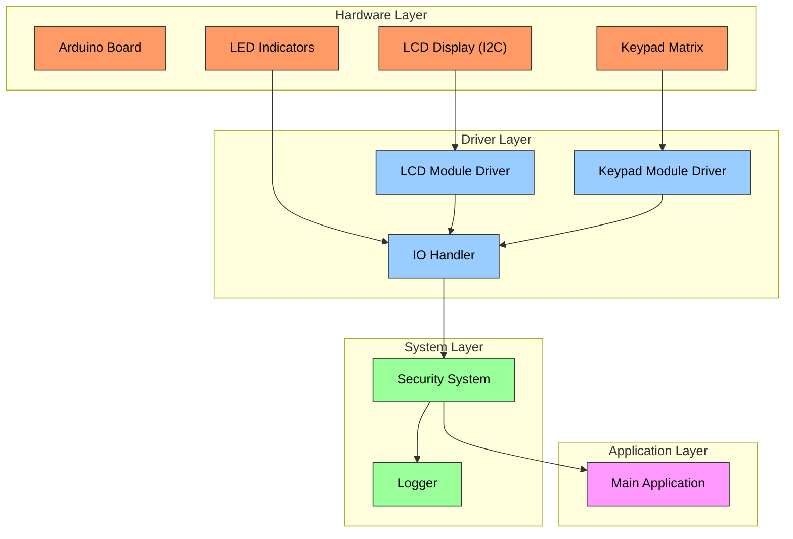
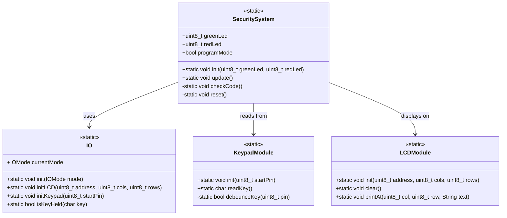
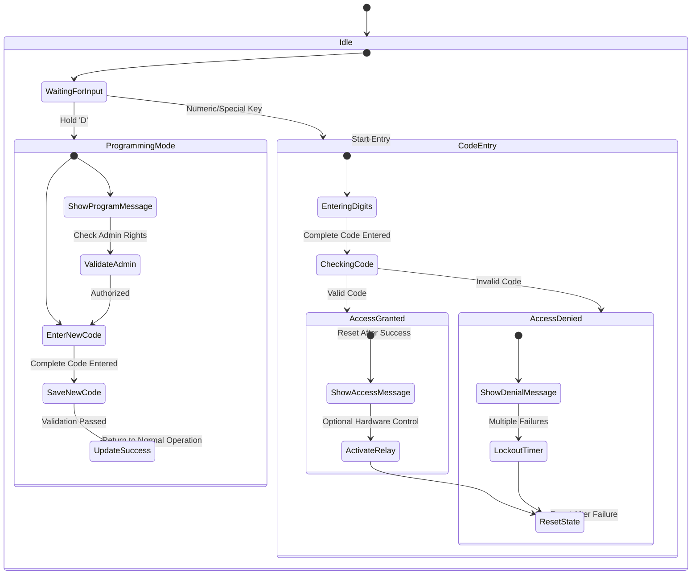
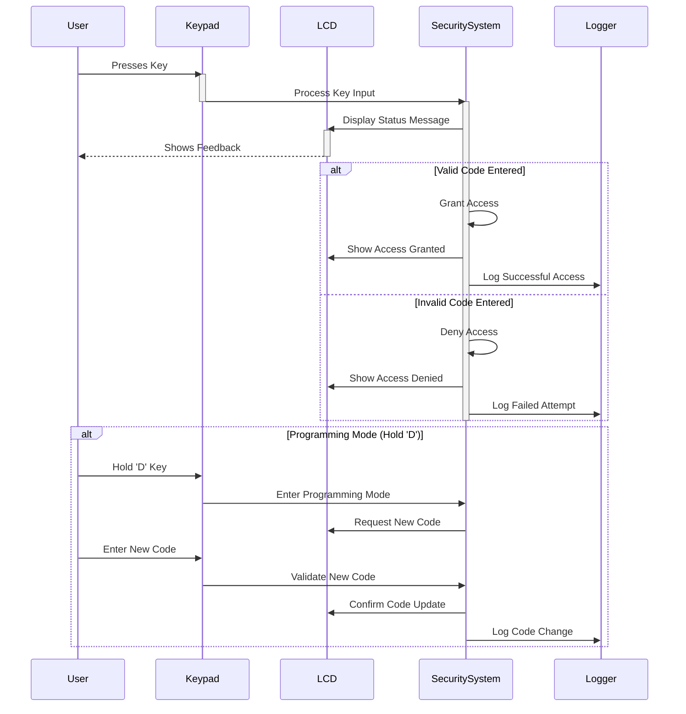
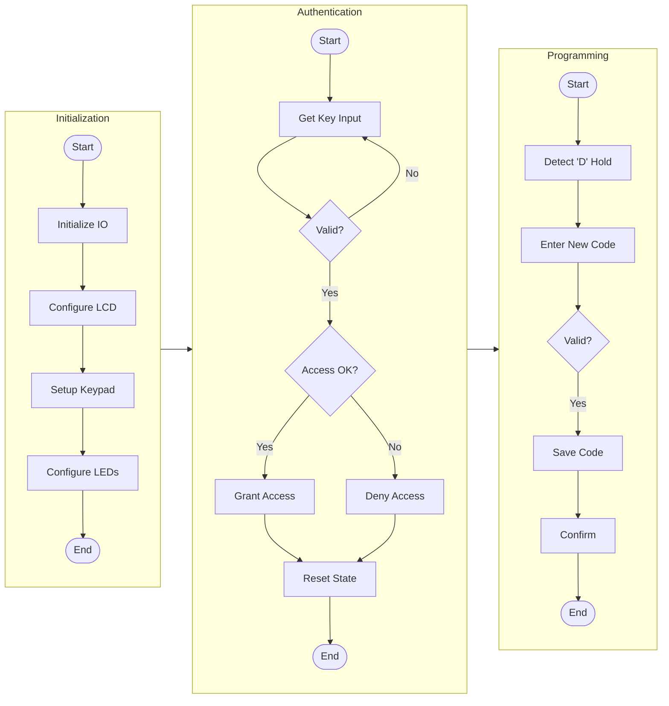
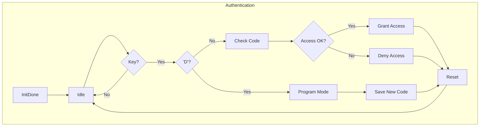

<div align="center">


**Ministerul Educației și Cercetării al Republicii Moldova**  
**Universitatea Tehnică a Moldovei**  
**Facultatea Calculatoare, Informatică și Microelectronică**  
**Departamentul Ingineria Software și Automatică**  

# REPORT

*on the course*  
## **Embedded Systems**  

### **Laboratory work Nr. 1.2**  

### THEME:  
**User interaction LCD+Keypad**  


---

**Developed by:**  
Polisciuc Vlad  
st. gr. FAF-223  

**Checked by:**  
asist. univ. Martinuic A  

---

**Chișinău, 2025**

</div>
<div style="page-break-after: always;"></div>

# Embedded Systems Security Module Report

## Introduction

### Analysis of Domain Situation

The security system implemented is a simple access control system using a keypad and LCD interface. This system represents a common application of embedded systems in security contexts, where user authentication is required for access control. The system is built on Arduino architecture, providing a lightweight and cost-effective solution for basic security needs.

The implementation focuses on a PIN-based authentication system with features such as:

-   Code entry verification
-   Visual feedback using LED indicators
-   Programming mode for changing the access code
-   Dual-interface support (Serial and LCD/Keypad)

This type of system is commonly used in scenarios requiring restricted access, such as door locks, safes, alarm systems, and other security applications where a simple but effective authentication mechanism is needed.

### Presentation of Hardware and Software Components

**Hardware Components:**

1.  **Arduino Board** - Core microcontroller platform providing the processing capabilities
2.  **16x2 LCD Display with I2C Interface** - Used for user feedback and system status display
3.  **4x4 Matrix Keypad** - Input interface for code entry
4.  **LED Indicators** - Visual feedback (Green for access granted, Red for denied)
5.  **Jumper Wires and Breadboard** - For circuit connections

**Software Components:**

1.  **IO Library** - Handles input/output operations with multiple interface support
2.  **SecuritySystem Library** - Manages core security functions and state
3.  **KeypadModule Library** - Handles keypad input and debouncing
4.  **LCDModule Library** - Provides interface to the LCD display
5.  **Logger Library** - Provides diagnostic and debugging capabilities
6.  **List Library** - Implements a linked list data structure for pin management

Each component has well-defined roles within the system, creating a modular and maintainable architecture.

### System Architecture Justification

The system follows a modular architecture with clear separation of concerns. This architectural choice offers several benefits:

1.  **Maintainability** - Each module can be updated independently
2.  **Reusability** - Modules like IO, KeypadModule, and LCDModule can be reused in other projects
3.  **Testability** - Each module can be tested in isolation
4.  **Scalability** - New features can be added without significant refactoring

The architecture includes abstraction layers that separate hardware-specific code from application logic. For example, the IO module provides a common interface for both serial and LCD/keypad modes, allowing the security system to operate identically regardless of the interface used.

Using object-oriented design with C++ classes creates a clean structure and encapsulates implementation details. The static method approach within classes provides namespace-like organization while maintaining minimal memory usage, which is important for resource-constrained embedded systems.

### Case Study: Access Control System

This security system can be applied in various contexts, such as:

1.  **Home Security** - As an entry system for doors or gates
2.  **Small Business Security** - For restricted areas or equipment
3.  **Educational Settings** - For laboratory access control

Consider a small business scenario: A company needs to restrict access to their server room. The implemented system can be installed at the entrance, requiring authorized personnel to enter a PIN code. The system provides:

-   Visual feedback through the LCD display and LEDs
-   Secure code storage in the microcontroller's memory
-   Administrator mode to change the access code when needed (by holding the 'D' key)
-   Low power consumption and reliable operation

The modular nature of the system allows for easy expansion, such as adding a relay to control an electronic lock, or connecting to a network for centralized monitoring. These features demonstrate the system's applicability in real-world security scenarios.

## Diagrams

For the architecture and behavior of our system, I've prepared several diagrams that illustrate different aspects of the implementation. These diagrams will be referenced throughout the report to explain the system's design and operation.

The block scheme diagram shows the overall system architecture, illustrating how components interact. The architectural diagram provides a more detailed view of the system's structure, while state diagrams and flowcharts explain the behavior of specific modules.

These diagrams are essential for understanding the system's operation and serve as documentation for future development or maintenance.

## Design

### Diagram 1: Architectural Sketch



The system follows a layered architecture with clear boundaries between components:

1.  **Hardware Layer** - Physical components including Arduino, LCD, keypad, and LEDs
2.  **Driver Layer** - Direct hardware interface modules (LCDModule, KeypadModule)
3.  **System Layer** - Core functionality modules (IO, SecuritySystem)
4.  **Application Layer** - Main application logic (main.cpp)

This architecture provides several advantages:

-   Clear separation of concerns
-   Maintainable and testable code
-   Ability to swap implementations without affecting other layers
-   Scalability for future enhancements

The IO module serves as a central interface that abstracts the specific hardware interfaces (Serial or LCD/Keypad) from the application logic. This allows the SecuritySystem module to function regardless of the chosen interface, demonstrating good design principles.

The modular approach with separate .h and .cpp files for each component follows C++ best practices and ensures that the interfaces are clearly defined and implementation details are hidden appropriately.

### Behavior Schemes and Algorithms

The system's behavior can be described using several key algorithms:

1.  **Authentication Flow**:
    
    -   User inputs a code using the keypad
    -   System compares the entered code with the stored one
    -   System provides feedback (access granted/denied) and resets for the next entry
2.  **Programming Mode Flow**:
    
    -   User holds the 'D' key to enter programming mode
    -   User enters a new code
    -   System stores the new code and confirms the update
    -   System returns to normal operation

These algorithms are implemented using a state-based approach, where the system tracks its current state and transitions based on user input and internal conditions. This approach simplifies the code and makes the behavior more predictable and easier to debug.

The debouncing implementation in the KeypadModule is particularly important for reliable operation, as it prevents multiple registrations of a single key press due to mechanical switch bouncing.

### Electrical Sketch


The electrical connections of the system are straightforward but must be carefully implemented for reliable operation:

1.  **LCD Connection**:
    
    -   SDA and SCL pins connected to Arduino's I2C pins
    -   VCC and GND connected to power supply
2.  **Keypad Connection**:
    
    -   8 consecutive pins for row and column connections
    -   Pull-up resistors used on input pins
3.  **LED Connections**:
    
    -   Green LED on pin 12 with current-limiting resistor
    -   Red LED on pin 13 with current-limiting resistor

The I2C connection for the LCD simplifies wiring by requiring only 4 wires (VCC, GND, SDA, SCL) instead of the 6+ wires needed for parallel connection. This reduces clutter and potential for wiring errors.

### Project Structure

The project is organized in a hierarchical structure that reflects the architectural components:

```
Embedded_Systems/
├── lib/
│   ├── IO/
│   │   ├── include/
│   │   │   └── io.h
│   │   └── src/
│   │       └── io.cpp
│   ├── KeypadModule/
│   │   ├── include/
│   │   │   └── KeypadModule.h
│   │   └── src/
│   │       └── KeypadModule.cpp
│   ├── LCDModule/
│   │   ├── include/
│   │   │   └── LCDModule.h
│   │   └── src/
│   │       └── LCDModule.cpp
│   ├── List/
│   │   ├── include/
│   │   │   └── List.h
│   │   └── src/
│   │       └── List.cpp
│   ├── Logger/
│   │   ├── include/
│   │   │   └── Logger.h
│   │   └── src/
│   │       └── Logger.cpp
│   └── SecuritySystem/
│       ├── include/
│       │   └── SecuritySystem.h
│       └── src/
│           └── SecuritySystems.cpp
└── src/
    └── main.cpp

```

This organization follows standard C++ project conventions, with include directories containing header files and src directories containing implementation files. It also separates libraries from the main application code, making the project structure clean and maintainable.

Each module has a specific role, and the directory structure reflects the system's architecture, making it easy to navigate and understand the codebase.

## Implementation

### Modular Implementation

The system is implemented using a modular approach, with each component encapsulated in its own set of files:

1.  **IO Module**: Provides a unified interface for input/output operations, supporting both serial and LCD/keypad modes.
2.  **SecuritySystem Module**: Implements the core security functionality, including code verification and mode switching.
3.  **KeypadModule**: Handles keypad input, including debouncing and key detection.
4.  **LCDModule**: Manages the LCD display, including positioning and text output.
5.  **Logger Module**: Provides debugging and logging capabilities with multiple log levels.
6.  **List Module**: Implements a simple linked list for managing collections of items.

Each module is implemented as a C++ class with static methods, which provides organization similar to namespaces while reducing memory overhead. This approach is well-suited for resource-constrained embedded systems.

### Header Files (.h) Interface Definitions

The header files define clear interfaces for each module, specifying what functionality is available to other parts of the system:

**IO.h**: Defines input/output methods that abstract the underlying hardware:

```cpp
class IO {
public:
    enum IOMode { SERIAL_MODE, LCD_KEYPAD_MODE };
    static void init(IOMode mode = SERIAL_MODE);
    static void initLCD(uint8_t address, uint8_t cols, uint8_t rows);
    static void initKeypad(uint8_t startPin);
    static void clearLCD();
    static void clearInputBuffer();
    static bool isKeyHeld(char key);
    static IOMode currentMode;
    // Private implementation details...
};

```

This interface allows the application to:

-   Initialize the I/O system in different modes
-   Configure LCD and keypad hardware
-   Perform common operations like clearing the display
-   Check for held keys (used for entering programming mode)

**SecuritySystem.h**: Defines the security system functionality:

```cpp
class SecuritySystem {
public:
    static void init(uint8_t greenLed, uint8_t redLed);
    static void update();
    // Private implementation details...
};

```

This simple interface exposes only the necessary methods:

-   `init()`: Set up the security system with LED pins
-   `update()`: Process input and update the system state

The clean interfaces hide implementation details while providing all necessary functionality, following the principle of information hiding.

### Implementation Files (.cpp)

The implementation files contain the detailed logic for each module, with thorough comments explaining the critical sections:

**SecuritySystem.cpp**: The core security logic implementation:

```cpp
void SecuritySystem::update() {
    // Check for keypress
    if (stdin->flags & _FDEV_SETUP_READ) {
        int c = getchar();
        if (c != EOF) {
            // Process key
            char key = (char)c;
            // Check for numeric and special keys
            if ((key >= '0' && key <= '9') || (key >= 'A' && key <= 'D') || key == '*' || key == '#') {
                if (codeIndex < CODE_LENGTH) {
                    enteredCode[codeIndex++] = key;
                    // Check if code is complete
                    if (codeIndex >= CODE_LENGTH) {
                        checkCode();
                    }
                }
            }
        }
    }
    // Check for program mode (hold D key)
    if (IO::isKeyHeld('D') && !programMode) {
        programMode = true;
        reset();
        printf("\nNew Code:");
    }
}

```

This method demonstrates several important aspects:

1.  Input handling using stdio interface for consistent operation across modes
2.  Processing key presses and storing entered code
3.  Special mode detection (programming mode) through held key detection
4.  State management for code entry process

The implementation carefully maintains the system's state and provides appropriate feedback through the configured interface.

**IO.cpp**: Handles the input/output operations:

```cpp
void IO::init(IOMode mode) {
    currentMode = mode;
    if (mode == SERIAL_MODE) {
        Serial.begin(9600);
        while (!Serial) delay(10);
    }
    // Setup stdin/stdout
    static FILE stream;
    if (mode == SERIAL_MODE) {
        fdev_setup_stream(&stream, serial_putchar, serial_getchar, _FDEV_SETUP_RW);
    } else {
        fdev_setup_stream(&stream, lcd_putchar, keypad_getchar, _FDEV_SETUP_RW);
    }
    stdin = stdout = &stream;
}

```

This implementation:

1.  Initializes the appropriate hardware based on the selected mode
2.  Sets up standard I/O streams to redirect to the selected interface
3.  Uses Arduino's Stream implementation for a consistent I/O interface

The use of stdio makes the code more portable and allows for easy switching between interfaces without changing application logic.

### Functional Block Schemes

Each implemented module follows a specific functional pattern:

**IO Module**:

-   Serves as middleware between the application and hardware
-   Provides consistent interface regardless of physical I/O method
-   Routes input and output through appropriate handlers
-   Manages hardware-specific initialization and configuration

**SecuritySystem Module**:

-   Implements the core application logic
-   Manages system state (normal mode vs. programming mode)
-   Processes input codes and provides feedback
-   Controls indicator LEDs for visual feedback

**KeypadModule**:

-   Scans the matrix keypad for pressed keys
-   Implements debouncing to prevent multiple registrations
-   Tracks key holds for special functions
-   Provides clean interface for key input

These functional patterns ensure each module has a clear responsibility and interacts with other modules through well-defined interfaces.
Let me generate the requested diagrams for your security system report. I'll create each diagram according to the specifications and include them in the appropriate sections.


The diagram above illustrates the complete system architecture, showing four distinct layers:

- Hardware Layer (orange): Physical components including Arduino, LCD display, keypad, and LED indicators
- Driver Layer (blue): Software drivers that communicate directly with hardware components
- System Layer (green): Core security functionality and logging mechanisms
- Application Layer (purple): Main application logic that coordinates all components

Arrows indicate data flow between components, with the IO Handler serving as a central coordinator for all hardware interactions.

### Diagram 2: X Module Block Scheme




This class diagram illustrates the SecuritySystem module's structure and its relationships with other components:

- Methods prefixed with '+' are public (accessible from outside the class)
- Methods prefixed with '-' are private (internal implementation details)
- All methods are marked as 'static', meaning they belong to the class rather than instances
- Arrows indicate dependencies: SecuritySystem uses IO for communication, reads from KeypadModule for input, and displays on LCDModule for output

### Diagram 3: Main File State Diagram




This state diagram illustrates the system's behavioral flow:

- Nested states (shown inside larger boxes) represent complex behaviors
- [*] represents the initial state within each box
- Transitions show how the system moves between states, with conditions shown after colons
- The diagram corresponds to the SecuritySystem class methods shown in the previous class diagram

The system operates primarily in three modes:

1. Idle: Waiting for user input
2. CodeEntry: Processing entered codes
3. ProgrammingMode: Updating access codes

### Diagram 4: Architectural Interaction Diagram




This sequence diagram illustrates the temporal flow of interactions between system components:

- Vertical bars show when each component is active
- 'alt' sections show alternative paths based on conditions
- Participants (boxes at top) represent the major components from our architecture diagram
- Arrows show communication between components, with solid arrows representing requests and dashed arrows showing responses

The diagram shows two main scenarios:

1. Normal operation: User input processing and authentication
2. Programming mode: Secure code update procedure

### Diagram 5: Method Block Diagrams




This flowchart breaks down the system's main operations into three distinct flows:

- Initialization: Setup sequence for all hardware components
- Authentication: Core security verification process
- Programming: Secure code update procedure

Elements are color-coded to represent different types:

- Blue boxes: Processing steps
- Light brown diamonds: Decision points
- Green rounded rectangles: Starting points
- Pink rounded rectangles: Ending points

Each flow corresponds to specific methods in our class diagram, showing the detailed implementation steps for each major operation.

### Diagram 6: Hardware Setup Schematic

[](https://mermaid.live/edit#pako:eNqNVN1u2jAUfhXLqNImhRXCT0M0VSIJIDSoKqi42LILNzZgEWzkJGKo6u0eYI-4J9mxzV_o1OIL-_j4-459Ph_7BSeSMuzjeSq3yZKoHD1FsUDQsuJ5ochmibqKFlzIHzHeWyiQRNEY_7RA3ShXLMm5FOgpOHkjvuA5SYG5t9AjF9nXZ3V7X6vWG6UIXUFSudCbGOOE7Naq3VYJ-ii3TAHSjLcDJQtBDXQ2fHAGD5HTmjmNL43ZkcQEtcZFZqMwgjDQo7GkRcrQp6Ebfr4isVkYAhF69Pf3n4NAqDUrUeEkAIK-BIJ5CTWNuoCCvoSCeRkVjjQqHJVR4ejDHL-x3YZQIFsDjUmu-K8rcpzIbQY0GE53EbnVqHwXoUw1CoZiLc6A7WrU-Vj_XqTJMKChoDwhuVTZFUcbKMaE1laPOords-4adSYs4xlEMhMdW4-Xsk-Y1gT6M3rjOvpFNjc3IIIQ9piZ9R3KvVq9Nzq-9WrdrNdUsfFBPV269L7i9DyMT9fGGx9UQvlM03yXcrGw8yQlWRaxOSL7ypnzNPUr_X7QaLedLFdyxfyKFzRb9YaTyFQqv1Iz7YKfJnTP9e7CXi84cpttzw2a73JXtgAtveP1g453pLuuF7ju-1szejx2uwN7HbjhXb3ltf7HPYtwEN-xojlW4r0c5zi4BPOHgMqOfm-Q8fmyvk1HX94-nfM1U46Orik4q13ADl4ztSacwh_7on0xzpdszWLsg0mJWsU4Fq-AI0UupzuRYD9XBXMwfGuLJfbnJM1gVmwoyVnECbyc9dG7IeK7lKc5oxwqd2y_dPOzv_4DC7nIoQ)


This hardware connection diagram illustrates the physical wiring of the system:

- Orange boxes represent Arduino pins and power connections
- Blue boxes show LCD module connections using I2C protocol
- Green boxes indicate keypad matrix pin assignments
- Pink boxes show LED indicator circuits with protective resistors

Each component requires specific connections:

- LCD uses only 4 wires (VCC, GND, SDA, SCL) thanks to I2C communication
- Keypad requires 8 digital pins (4 rows, 4 columns)
- LED indicators each need a resistor to limit current and prevent damage

### Diagram 7: Main Algorithm Flowchart


## Results Presentation

### Interface Screenshots

The system interface provides clear feedback to the user through the LCD display:

1.  **Startup Screen**:

When starting the program, user is welcomed by this screen:

```
Security System
Enter code:

```


2.  **Access Granted Screen**:

If the user inputs the correct password via keypad - initially '1234' then the led turns green and 'Acess Granted!' is displayed on the lcd

```
Access Granted!

```


3.  **Access Denied Screen**:

If the user inputs the wrong password via keypad - initially '1234' then the led turns red and 'Acess Denied!' is displayed on the lcd

```
Access Denied!

```


by long pressing 'D' on the keypad the suer can enter programming mode where they can set the new password to be used later

4.  **Programming Mode Screen**:

```
New Code:

```


5.  **Code Updated Screen**:

After setting the enw password the user is notified that the password has changed

```
Code updated!

```


These screens provide a simple but effective user interface, clearly communicating the system's state and expected actions.

### Hardware Setup Photos

The physical setup consists of:

-   Arduino board (typically an UNO or similar)
-   16x2 LCD display with I2C backpack
-   4x4 matrix keypad
-   Two LEDs (green and red) with current-limiting resistors
-   Breadboard and jumper wires for connections

All components are connected according to the electrical schematic described earlier, with the LCD using I2C communication and the keypad requiring 8 digital pins (4 for rows, 4 for columns).

### Serial Interface Reports

When operating in Serial mode, the system produces output like:

```
Security System
Enter code:
1
2
3
4
Access Granted!
Enter code:

```

When an incorrect code is entered:

```
Enter code:
5
6
7
8
Access Denied!
Enter code:

```

In programming mode:

```
Enter code:
[D key held]
New Code:
9
8
7
6
Code updated!
Enter code:

```

These serial outputs mirror what would be shown on the LCD in LCD/Keypad mode, providing a consistent user experience across interfaces.

This functions because the IO module has 2 diffeerent modes of operation, it eithe rredirects stdio to serial monitor or to the lcd and keypad, this can be toggled in the main file.

```cpp
void IO::init(IOMode mode) {
    currentMode = mode;
    
    if (mode == SERIAL_MODE) {
        Serial.begin(9600);
        while (!Serial) delay(10);
    }
    
    // Setup stdin/stdout
    static FILE stream;
    
    if (mode == SERIAL_MODE) {
        fdev_setup_stream(&stream, serial_putchar, serial_getchar, _FDEV_SETUP_RW);
    } else {
        fdev_setup_stream(&stream, lcd_putchar, keypad_getchar, _FDEV_SETUP_RW);
    }
    
    stdin = stdout = &stream;
}
```

## Conclusion

### Performance Analysis

The implemented security system performs well for its intended purpose, with several notable characteristics:

**Strengths:**

1.  Responsive user interface with minimal latency
2.  Reliable key detection with debouncing
3.  Flexible I/O options (Serial or LCD/Keypad)
4.  Modular design for easy maintenance and extension
5.  Low memory footprint suitable for Arduino's limited resources

**Limitations:**

1.  Fixed code length (4 digits) - not configurable at runtime
2.  Single user code - no multi-user support
3.  No persistent storage for codes (lost on power cycle)
4.  Limited security features (no lockout after failed attempts)
5.  No network connectivity for remote monitoring or management

**Improvement Opportunities:**

1.  Implement EEPROM storage for persistent code storage
2.  Add multiple user support with different access levels
3.  Implement a lockout mechanism after multiple failed attempts
4.  Add timeout features for enhanced security
5.  Integrate with other systems (door lock control, alarm system)

### Technology Impact in Real Applications

The security system implemented here represents a foundational approach that can be expanded for various real-world applications:

1.  **Smart Home Integration**: Could be enhanced to interface with home automation systems, providing authenticated access to smart home controls.
    
2.  **Commercial Access Control**: With minor enhancements like RFID or fingerprint sensor integration, could serve as a low-cost access control solution for small businesses.
    
3.  **Educational Tool**: Serves as an excellent platform for teaching embedded systems concepts, combining hardware interfacing, user interface design, and security considerations.
    
4.  **Industrial Equipment Protection**: Could be adapted to protect access to industrial machinery or equipment, requiring operator authentication before use.
    

The modular design principles demonstrated in this project are widely applicable in commercial embedded systems, where reliability, maintainability, and extensibility are critical requirements.

### References

1.  Arduino Official Documentation - [Arduino Reference](https://www.arduino.cc/reference/en/)
2.  Liquid Crystal I2C Library - [Arduino LiquidCrystal_I2C](https://github.com/johnrickman/LiquidCrystal_I2C)
3.  Embedded Systems Design: A Unified Hardware/Software Introduction - [Book by Frank Vahid and Tony Givargis](https://www.wiley.com/en-us/Embedded+System+Design%3A+A+Unified+Hardware+Software+Introduction-p-9780471386780)
4.  Security in Embedded Systems: A Model-Based Approach - [IEEE Paper](https://ieeexplore.ieee.org/document/7975337)

## AI Note

In creating this report, the author utilized Claude as an AI assistant for generating and consolidating textual content. The information presented has been reviewed, validated, and adjusted according to the laboratory requirements. Diagrams were editted with the use of Phind to look better and fit into pages.
